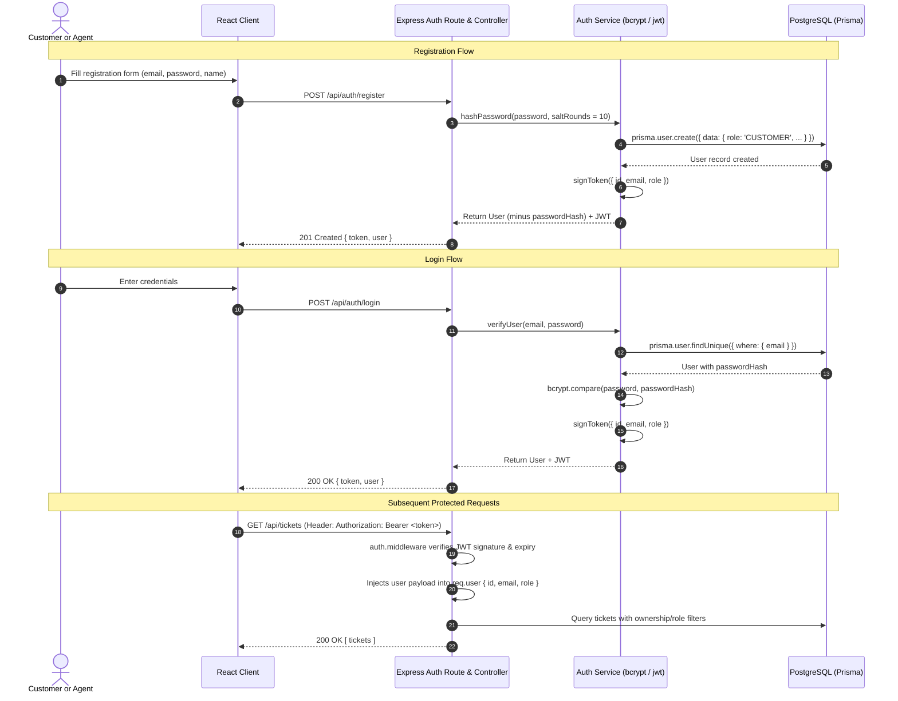

# SmartSupport AI — REST API Contract & Data Flow Specification

This document defines the complete REST API specification, backend execution flow, authorization boundaries, and step-by-step data journeys for **SmartSupport AI**.

It complements:
- [PROJECT_PLAN.md](file:///D:/prachi/Antigravity-Projects/SmartSupport%20AI/PROJECT_PLAN.md) — High-level architecture, tech stack, and roadmap.
- [PROJECT_STRUCTURE.md](file:///D:/prachi/Antigravity-Projects/SmartSupport%20AI/PROJECT_STRUCTURE.md) — Directory layout and file responsibilities.

---

## Table of Contents
1. [Architectural Principles for the API](#1-architectural-principles-for-the-api)
2. [Authentication Flow & Token Lifecycle](#2-authentication-flow--token-lifecycle)
3. [REST API Contract Specifications](#3-rest-api-contract-specifications)
   - [Authentication Endpoints](#31-authentication-endpoints)
   - [Ticket Management Endpoints](#32-ticket-management-endpoints)
   - [Message & Conversation Endpoints](#33-message--conversation-endpoints)
   - [AI Assistance Endpoints](#34-ai-assistance-endpoints)
   - [Dashboard & Analytics Endpoints](#35-dashboard--analytics-endpoints)
4. [Backend Layered Request Flow](#4-backend-layered-request-flow)
5. [End-to-End Application Data Flows](#5-end-to-end-application-data-flows)
6. [Strict Authorization Matrix](#6-strict-authorization-matrix)
7. [Things We Are Intentionally NOT Building](#7-things-we-are-intentionally-not-building)

---

## 1. Architectural Principles for the API

1. **Predictable REST Conventions**: Standard HTTP verbs (`GET`, `POST`, `PUT`), structured JSON payloads, and standard HTTP response status codes (`200 OK`, `201 Created`, `400 Bad Request`, `401 Unauthorized`, `403 Forbidden`, `404 Not Found`, `500 Internal Server Error`).
2. **Server-Side Enforcement**: Security, ownership checks, and role rules are strictly enforced in backend middleware and services. The frontend UI reflects permissions for user experience, but the backend is the authoritative security boundary.
3. **Stateless Communication**: The backend does not maintain server-side sessions; every authenticated request carries a signed JSON Web Token (JWT) in the `Authorization` header.
4. **Assistive AI Boundary**: The Gemini AI integration is strictly a backend service. No Gemini API keys or direct client-to-Gemini requests exist on the frontend.

---

## 2. Authentication Flow & Token Lifecycle

### High-Level Flow


### Standard Auth Header Format
All protected endpoints require the following HTTP header:
```http
Authorization: Bearer <jwt_token_here>
```

---

## 3. REST API Contract Specifications

### 3.1 Authentication Endpoints

#### 1. Register New Customer
- **Method & URL**: `POST /api/auth/register`
- **Access**: Public (unauthenticated)
- **Purpose**: Creates a new user account with the `CUSTOMER` role.
- **Request Body**:
  ```json
  {
    "name": "Alex Johnson",
    "email": "alex@example.com",
    "password": "Password123!"
  }
  ```
- **Response**: `201 Created`
  ```json
  {
    "token": "eyJhbGciOiJIUzI1NiIsInR5cCI6...",
    "user": {
      "id": "cuid-user-1",
      "name": "Alex Johnson",
      "email": "alex@example.com",
      "role": "CUSTOMER",
      "createdAt": "2026-09-30T10:00:00.000Z"
    }
  }
  ```
- **Authorization Considerations**:
  - The `role` is unconditionally assigned as `CUSTOMER` by the backend. Clients cannot register themselves as `AGENT` through this endpoint. Agent accounts are seeded or provisioned directly in the database.
  - Returns `400 Bad Request` if the email is already in use.

---

#### 2. User Login
- **Method & URL**: `POST /api/auth/login`
- **Access**: Public (unauthenticated)
- **Purpose**: Verifies email and password, returning a signed JWT and user profile.
- **Request Body**:
  ```json
  {
    "email": "alex@example.com",
    "password": "Password123!"
  }
  ```
- **Response**: `200 OK`
  ```json
  {
    "token": "eyJhbGciOiJIUzI1NiIsInR5cCI6...",
    "user": {
      "id": "cuid-user-1",
      "name": "Alex Johnson",
      "email": "alex@example.com",
      "role": "CUSTOMER"
    }
  }
  ```
- **Authorization Considerations**:
  - Compares the plaintext password against the stored `passwordHash` using `bcrypt.compare`.
  - Returns generic `401 Unauthorized` for non-existent emails or incorrect passwords to prevent account enumeration.

---

### 3.2 Ticket Management Endpoints

#### 3. Create Ticket
- **Method & URL**: `POST /api/tickets`
- **Access**: `CUSTOMER` only
- **Purpose**: Submits a new support ticket.
- **Request Body**:
  ```json
  {
    "title": "Double charge on monthly subscription",
    "description": "I was charged twice on September 28th for my Pro plan. Please issue a refund.",
    "category": "BILLING"
  }
  ```
- **Response**: `201 Created`
  ```json
  {
    "id": "cuid-ticket-101",
    "title": "Double charge on monthly subscription",
    "description": "I was charged twice on September 28th for my Pro plan. Please issue a refund.",
    "status": "OPEN",
    "priority": "MEDIUM",
    "category": "BILLING",
    "customerId": "cuid-user-1",
    "assignedAgentId": null,
    "createdAt": "2026-09-30T10:05:00.000Z",
    "updatedAt": "2026-09-30T10:05:00.000Z"
  }
  ```
- **Authorization Considerations**:
  - `customerId` is automatically extracted from `req.user.id` (set by the JWT middleware). The client cannot specify a different customer's ID.
  - New tickets always default to `status: OPEN` and `priority: MEDIUM`.

---

#### 4. List Tickets
- **Method & URL**: `GET /api/tickets`
- **Access**: `CUSTOMER` and `AGENT` (with role-filtered responses)
- **Purpose**: Lists tickets. For customers, returns only their own tickets. For agents, returns all tickets with optional search and filter queries.
- **Query Parameters (Agent)**:
  - `status`: `OPEN | IN_PROGRESS | WAITING_FOR_CUSTOMER | RESOLVED | CLOSED`
  - `priority`: `LOW | MEDIUM | HIGH | URGENT`
  - `category`: `BILLING | TECHNICAL | ACCOUNT | SUBSCRIPTION | REFUND | OTHER`
  - `search`: Keyword string matching title or description
- **Response**: `200 OK`
  ```json
  [
    {
      "id": "cuid-ticket-101",
      "title": "Double charge on monthly subscription",
      "status": "OPEN",
      "priority": "HIGH",
      "category": "BILLING",
      "customerId": "cuid-user-1",
      "customer": {
        "name": "Alex Johnson",
        "email": "alex@example.com"
      },
      "assignedAgentId": null,
      "createdAt": "2026-09-30T10:05:00.000Z",
      "_count": {
        "messages": 2
      }
    }
  ]
  ```
- **Authorization Considerations**:
  - If `req.user.role === 'CUSTOMER'`, the service strictly appends `where: { customerId: req.user.id }`.
  - If `req.user.role === 'AGENT'`, the service queries the entire ticket repository and applies the optional query filters.

---

#### 5. Get Ticket By ID
- **Method & URL**: `GET /api/tickets/:id`
- **Access**: `CUSTOMER` (owner only) and `AGENT`
- **Purpose**: Fetches complete ticket details, including conversation messages and (for agents) AI analysis.
- **Response**: `200 OK`
  ```json
  {
    "id": "cuid-ticket-101",
    "title": "Double charge on monthly subscription",
    "description": "I was charged twice on September 28th for my Pro plan. Please issue a refund.",
    "status": "OPEN",
    "priority": "HIGH",
    "category": "BILLING",
    "customerId": "cuid-user-1",
    "customer": {
      "id": "cuid-user-1",
      "name": "Alex Johnson",
      "email": "alex@example.com"
    },
    "assignedAgent": null,
    "createdAt": "2026-09-30T10:05:00.000Z",
    "updatedAt": "2026-09-30T10:05:00.000Z",
    "aiAnalysis": {
      "suggestedCategory": "BILLING",
      "suggestedPriority": "HIGH",
      "sentiment": "Frustrated",
      "summary": "Customer experienced duplicate billing for Pro subscription and requests a refund.",
      "suggestedReply": "Hello Alex,\n\nWe apologize for the duplicate charge on your account..."
    }
  }
  ```
- **Authorization Considerations**:
  - Ownership Check: If the caller is a `CUSTOMER` and `ticket.customerId !== req.user.id`, the backend immediately returns `404 Not Found` (or `403 Forbidden`).
  - Privacy Stripping: If the caller is a `CUSTOMER`, the `aiAnalysis` object is stripped out of the response.

---

#### 6. Update Ticket (Status, Priority, Assignment)
- **Method & URL**: `PUT /api/tickets/:id`
- **Access**: `AGENT` only
- **Purpose**: Updates ticket lifecycle attributes (status, priority, agent assignment).
- **Request Body** (all fields optional):
  ```json
  {
    "status": "IN_PROGRESS",
    "priority": "HIGH",
    "assignedAgentId": "cuid-agent-2"
  }
  ```
- **Response**: `200 OK`
  ```json
  {
    "id": "cuid-ticket-101",
    "status": "IN_PROGRESS",
    "priority": "HIGH",
    "assignedAgentId": "cuid-agent-2",
    "updatedAt": "2026-09-30T10:15:00.000Z"
  }
  ```
- **Authorization Considerations**:
  - Restricted strictly to `AGENT` role via `role.middleware.ts`. If a customer attempts this, returns `403 Forbidden`.
  - Validates that values belong to allowed enums (`TicketStatus`, `TicketPriority`).

---

### 3.3 Message & Conversation Endpoints

#### 7. List Ticket Messages
- **Method & URL**: `GET /api/tickets/:id/messages`
- **Access**: `CUSTOMER` (owner only) and `AGENT`
- **Purpose**: Retrieves all conversational messages and replies for a specific ticket.
- **Response**: `200 OK`
  ```json
  [
    {
      "id": "cuid-msg-1",
      "ticketId": "cuid-ticket-101",
      "content": "We have located your duplicate transaction and initiated the refund.",
      "isInternalNote": false,
      "createdAt": "2026-09-30T10:20:00.000Z",
      "sender": {
        "id": "cuid-agent-2",
        "name": "Jordan (Support Agent)",
        "role": "AGENT"
      }
    }
  ]
  ```
- **Authorization Considerations**:
  - Ownership: Customer must own the ticket.
  - **Internal Note Privacy**: If `req.user.role === 'CUSTOMER'`, the backend automatically appends `where: { isInternalNote: false }` to the Prisma query. Customers can never see internal agent notes.

---

#### 8. Post a Message / Reply / Internal Note
- **Method & URL**: `POST /api/tickets/:id/messages`
- **Access**: `CUSTOMER` (owner only) and `AGENT`
- **Purpose**: Posts a reply to the ticket, or adds an internal agent note.
- **Request Body**:
  ```json
  {
    "content": "Thank you for the quick resolution!",
    "isInternalNote": false
  }
  ```
- **Response**: `201 Created`
  ```json
  {
    "id": "cuid-msg-2",
    "ticketId": "cuid-ticket-101",
    "senderId": "cuid-user-1",
    "content": "Thank you for the quick resolution!",
    "isInternalNote": false,
    "createdAt": "2026-09-30T10:25:00.000Z"
  }
  ```
- **Authorization Considerations**:
  - If `req.user.role === 'CUSTOMER'`, `isInternalNote` is forced to `false`. Customers cannot post internal notes.
  - Customer ownership verification: Customers can only post to tickets they own.
  - Status progression: When an agent replies, backend automatically sets status to `WAITING_FOR_CUSTOMER` (if currently `IN_PROGRESS`). When a customer replies, backend sets status to `IN_PROGRESS` (if currently `WAITING_FOR_CUSTOMER`).

---

### 3.4 AI Assistance Endpoints

#### 9. Analyze Ticket with Gemini
- **Method & URL**: `POST /api/ai/analyze-ticket`
- **Access**: `AGENT` only
- **Purpose**: Triggers backend analysis of a ticket using the Google Gemini API, generating category, priority, sentiment, summary, and a suggested reply. Persists the result to the `AIAnalysis` table.
- **Request Body**:
  ```json
  {
    "ticketId": "cuid-ticket-101"
  }
  ```
- **Response**: `200 OK` (or `201 Created`)
  ```json
  {
    "id": "cuid-ai-1",
    "ticketId": "cuid-ticket-101",
    "suggestedCategory": "BILLING",
    "suggestedPriority": "HIGH",
    "sentiment": "Frustrated",
    "summary": "Customer charged twice for monthly subscription renewal and requested refund.",
    "suggestedReply": "Hello Alex,\n\nThank you for reaching out to support. We sincerely apologize for the duplicate charge on September 28th. We have verified the transaction and initiated a full refund for the extra charge. Please allow 3-5 business days for it to appear on your bank statement.\n\nBest regards,\nSmartSupport Team",
    "createdAt": "2026-09-30T10:06:00.000Z"
  }
  ```
- **Authorization Considerations**:
  - Restricted strictly to `AGENT` role. Customers cannot trigger AI analysis.
  - Handled by `ai.service.ts` using the server-side `GEMINI_API_KEY`. If Gemini is unavailable, returns a clean `503 Service Unavailable` with a user-friendly error message, without crashing the server.

---

#### 10. Regenerate Suggested Reply
- **Method & URL**: `POST /api/ai/suggest-reply`
- **Access**: `AGENT` only
- **Purpose**: Generates an alternative or updated draft response for the agent to review, optionally based on additional tone instructions or recent messages.
- **Request Body**:
  ```json
  {
    "ticketId": "cuid-ticket-101",
    "tone": "empathic"
  }
  ```
- **Response**: `200 OK`
  ```json
  {
    "suggestedReply": "Hi Alex,\n\nI understand how concerning unexpected charges can be, and I am here to help. I have already processed the refund for the duplicate charge. You should see it in 3-5 business days."
  }
  ```
- **Authorization Considerations**:
  - `AGENT` only.
  - This draft reply is **only** returned to the agent's browser. It is **never** sent to the customer until the agent explicitly reviews and posts it via `POST /api/tickets/:id/messages`.

---

### 3.5 Dashboard & Analytics Endpoints

#### 11. Get Dashboard Statistics
- **Method & URL**: `GET /api/dashboard/stats`
- **Access**: `AGENT` only
- **Purpose**: Provides aggregate support metrics and ticket distributions for the agent dashboard.
- **Response**: `200 OK`
  ```json
  {
    "ticketCounts": {
      "total": 42,
      "open": 12,
      "inProgress": 18,
      "waitingForCustomer": 5,
      "resolved": 7
    },
    "priorityCounts": {
      "urgent": 3,
      "high": 9,
      "medium": 20,
      "low": 10
    },
    "sentimentDistribution": {
      "positive": 14,
      "neutral": 18,
      "frustrated": 8,
      "angry": 2
    },
    "averageResolutionTimeHours": 4.5
  }
  ```
- **Authorization Considerations**:
  - `AGENT` only. Customers receive `403 Forbidden`.

---

## 4. Backend Layered Request Flow

Every API request follows a strict, predictable 5-layer journey through the backend:

```
[ Incoming Client Request ]
           │
           ▼
┌─────────────────────────────────┐
│ 1. ROUTE LAYER                  │  src/routes/*.routes.ts
│ • Matches HTTP Method & Path    │
│ • Attaches middlewares          │
└──────────┬──────────────────────┘
           │
           ▼
┌─────────────────────────────────┐
│ 2. MIDDLEWARE LAYER             │  src/middleware/*.middleware.ts
│ • auth.middleware (Verify JWT)  │
│ • role.middleware (Check role)  │
│ • validate.middleware (Schema)  │
└──────────┬──────────────────────┘
           │
           ▼
┌─────────────────────────────────┐
│ 3. CONTROLLER LAYER             │  src/controllers/*.controller.ts
│ • Extracts req.params, req.body │
│ • Validates input format        │
│ • Calls appropriate service     │
│ • Sends HTTP status & JSON res  │
└──────────┬──────────────────────┘
           │
           ▼
┌─────────────────────────────────┐
│ 4. SERVICE LAYER                │  src/services/*.service.ts
│ • Pure business logic           │
│ • Calculates data, verifies rules│
│ • Coordinates DB and Gemini AI  │
└──────────┬──────────────────────┘
           │
     ┌─────┴────────────────┐
     ▼                      ▼
┌────────────────┐   ┌────────────────┐
│ 5a. PRISMA ORM │   │ 5b. GEMINI API │  src/prisma / External Google API
│ PostgreSQL SQL │   │ Outbound HTTPS │
└────────────────┘   └────────────────┘
```

### Detailed AI Execution Flow
```mermaid
flowchart LR
    UI["Frontend (Agent UI)"] -->|POST /api/ai/analyze-ticket| Route["routes/ai.routes.ts"]
    Route -->|auth & requireAgent| Ctrl["controllers/ai.controller.ts"]
    Ctrl -->|calls analyzeTicket(id)| Svc["services/ai.service.ts"]
    Svc -->|Reads ticket context| DB1[("PostgreSQL via Prisma")]
    Svc -->|Builds prompt with geminiPrompt.ts| GemAPI["Google Gemini API"]
    GemAPI -->|Returns JSON { summary, reply... }| Svc
    Svc -->|Persists AIAnalysis record| DB2[("PostgreSQL via Prisma")]
    Svc -->|Returns typed AIAnalysis| Ctrl
    Ctrl -->|HTTP 200 JSON| UI
```

---

## 5. End-to-End Application Data Flows

Here is the step-by-step trace of the 17 core operations:

### 1. Customer Registration
1. Customer enters name, email, and password on `/register`.
2. Frontend calls `POST /api/auth/register`.
3. Backend service hashes password using `bcrypt` (10 rounds).
4. Prisma writes new record to `User` table with `role: CUSTOMER`.
5. Backend creates signed JWT containing `{ id, email, role: 'CUSTOMER' }`.
6. Frontend receives token and user profile, saves token in `localStorage`/state, and navigates to the customer dashboard.

### 2. Customer Login
1. Customer enters email and password on `/login`.
2. Frontend calls `POST /api/auth/login`.
3. Backend retrieves user by email from PostgreSQL via Prisma.
4. Service compares password against `passwordHash` using `bcrypt.compare`.
5. If valid, signs a JWT and returns user details.
6. Frontend sets authentication context and redirects based on user role (`/customer/tickets` for customers, `/agent/queue` for agents).

### 3. Customer Creates a Ticket
1. Customer fills out title, category, and issue description on `/customer/tickets/new`.
2. Frontend calls `POST /api/tickets` with JWT header.
3. Auth middleware extracts `req.user.id`.
4. Service saves ticket in PostgreSQL with `status: OPEN`, `priority: MEDIUM`, and `customerId: req.user.id`.
5. (Optional background trigger): Backend can initiate asynchronous Gemini AI analysis immediately upon creation.
6. Backend returns created ticket (`201 Created`).

### 4. Customer Views Their Tickets
1. Customer visits `/customer/tickets`.
2. Frontend calls `GET /api/tickets`.
3. Backend service recognizes `req.user.role === 'CUSTOMER'` and executes:
   `prisma.ticket.findMany({ where: { customerId: req.user.id } })`.
4. Returns array of tickets owned by that customer. Customer cannot see any other tickets.

### 5. Agent Views the Ticket Queue
1. Agent navigates to `/agent/queue`.
2. Frontend calls `GET /api/tickets?status=OPEN&priority=HIGH`.
3. Backend checks `req.user.role === 'AGENT'`.
4. Service applies the status/priority query filters without restricting `customerId`.
5. Returns list of all tickets across all customers matching the criteria.

### 6. Agent Opens a Ticket
1. Agent clicks a ticket from the queue, navigating to `/agent/tickets/:id`.
2. Frontend calls `GET /api/tickets/:id`.
3. Backend checks agent role and returns ticket details, customer info, conversation history, and existing `AIAnalysis` (if already generated).

### 7. Agent Requests AI Ticket Analysis
1. If the ticket has not yet been analyzed (or if agent clicks "Re-analyze"), agent clicks **Analyze with AI**.
2. Frontend calls `POST /api/ai/analyze-ticket` with `{ ticketId: "cuid-ticket-101" }`.

### 8. Backend Sends Ticket Information to Gemini
1. `ai.controller.ts` calls `ai.service.ts`.
2. `ai.service.ts` fetches ticket title, initial description, and customer history.
3. Formulates a strict system prompt via `utils/geminiPrompt.ts`.
4. Sends HTTPS request to Google Gemini API using `process.env.GEMINI_API_KEY`.

### 9. Gemini Returns Structured Analysis
1. Gemini processes the issue context.
2. Returns a structured JSON response matching the required schema:
   - `suggestedCategory`
   - `suggestedPriority`
   - `sentiment`
   - `summary`
   - `suggestedReply`

### 10. Backend Stores the AI Analysis
1. `ai.service.ts` parses and validates the Gemini JSON response.
2. Service calls Prisma:
   `prisma.aIAnalysis.upsert({ where: { ticketId }, update: { ... }, create: { ... } })`.
3. Record is safely stored in PostgreSQL.

### 11. Agent Views the AI Analysis
1. `ai.controller.ts` responds with the saved `AIAnalysis` object.
2. Frontend receives data and displays:
   - **Sentiment Indicator** (e.g., Orange badge: "Frustrated")
   - **Suggested Priority & Category**
   - **Issue Summary Card** (2-sentence briefing)
   - **Suggested Reply Draft Box**

### 12. Agent Generates an AI Suggested Reply
1. Agent inspects the draft reply generated by Gemini.
2. If desired, agent clicks "Regenerate Reply" with a selected tone (e.g., "More Formal", "More Empathic").
3. Backend calls `POST /api/ai/suggest-reply` and returns the newly drafted text.

### 13. Agent Edits/Reviews the Reply
1. The suggested draft appears inside an editable textarea in the agent's **Workbench**.
2. **Crucial Safety Step**: The agent reads the text, adjusts names, adds specific account details or instructions, and corrects any inaccuracies.
3. Nothing has been sent to the customer yet.

### 14. Agent Sends the Final Reply
1. Agent clicks **Send Reply**.
2. Frontend calls `POST /api/tickets/:id/messages` with `{ content: "...", isInternalNote: false }`.
3. Backend saves the message with `senderId: req.user.id`.
4. Backend automatically updates ticket status to `WAITING_FOR_CUSTOMER`.

### 15. Customer Sees the Reply
1. Customer visits or refreshes their ticket detail page.
2. Frontend calls `GET /api/tickets/:id/messages`.
3. Backend returns all non-internal messages.
4. Customer sees the polite, helpful, agent-verified response.

### 16. Agent Changes Ticket Status
1. Agent resolves the ticket by selecting "Resolved" from the status dropdown.
2. Frontend calls `PUT /api/tickets/:id` with `{ status: "RESOLVED" }`.
3. Backend validates status enum and updates the record in PostgreSQL.

### 17. Agent Views Dashboard Statistics
1. Agent navigates to `/agent/dashboard`.
2. Frontend calls `GET /api/dashboard/stats`.
3. Backend service runs Prisma aggregations:
   - Total ticket count by status
   - Count by priority
   - Breakdown of customer sentiments from `AIAnalysis`
4. Frontend renders metric cards and Recharts visualizations.

---

## 6. Strict Authorization Matrix

To guarantee security, permissions are defined by role and enforced at the middleware level:

| Action / Resource | CUSTOMER | AGENT | Backend Enforcement Mechanism |
| :--- | :---: | :---: | :--- |
| **Register Account** | Allowed | Seeded only | Assigned role defaults to `CUSTOMER` in `auth.service.ts` |
| **Create Ticket** | Allowed | Disallowed | `POST /api/tickets` restricted to `CUSTOMER` role |
| **View Own Tickets** | Allowed | Allowed | Backend query filtered by `customerId === req.user.id` |
| **View Other Customer Tickets** | **Denied** | Allowed | Attempt returns `404` or `403` |
| **Update Status / Priority / Assignee** | **Denied** | Allowed | `PUT /api/tickets/:id` guarded by `role.middleware('AGENT')` |
| **Send Public Message** | Allowed (own) | Allowed | Validates ticket ownership before write |
| **Send Internal Note** | **Denied** | Allowed | `isInternalNote` forced to `false` for customers |
| **View Internal Notes** | **Denied** | Allowed | Query filters `isInternalNote: false` for customers |
| **Trigger / View AI Analysis** | **Denied** | Allowed | `routes/ai.routes.ts` guarded by `role.middleware('AGENT')` |
| **View Dashboard & Metrics** | **Denied** | Allowed | `routes/dashboard.routes.ts` guarded by `role.middleware('AGENT')` |

> [!IMPORTANT]
> **Backend vs Frontend Enforcement**:
> Hiding a button in React is only for visual user experience. The backend middleware (`auth.middleware.ts` and `role.middleware.ts`) must inspect the decrypted JWT on every single incoming HTTP request to verify whether the caller has the necessary permissions.

---

## 7. Things We Are Intentionally NOT Building

To maintain high code quality, realistic scope, and prevent over-engineering for this medium-level SaaS project, the following features are **explicitly excluded**:

1. **Admin / Manager / Supervisor Roles**: We strictly use only `CUSTOMER` and `AGENT`. There is no hierarchy of support supervisors or custom RBAC permission matrices.
2. **Real-time WebSockets / Socket.io**: Live message streaming adds substantial complexity with connection states. TanStack Query with polling or manual refetching provides a reliable, clean experience without WebSocket infrastructure.
3. **Microservices Architecture**: The backend is a clean, modular **monolithic Express API**. Splitting services across multiple network nodes is unnecessary and counter-productive for this scope.
4. **Kubernetes Orchestration**: Deployment targets are simple, managed services (Vercel, Render/Railway, Neon/Supabase). Kubernetes clusters and Helm charts are out of scope.
5. **Payment Processing (Stripe / PayPal)**: "Billing" and "Refund" exist as support ticket categories, but actual credit card charging or payment gateways are not implemented.
6. **External Email / SMS Notification Infrastructure**: We do not configure transactional email providers (SendGrid, Mailgun) or SMS gateways (Twilio). In-app message history is sufficient.
7. **Custom Machine Learning Model Training**: We do not fine-tune or train local neural networks. We leverage Google Gemini via prompt engineering and structured schema outputs.
8. **Complex BPMN Ticket Workflow Engines**: No configurable state machines, SLA breach auto-escalations, or visual workflow builders. Tickets follow straightforward status transitions (`OPEN` → `IN_PROGRESS` → `RESOLVED` → `CLOSED`).
