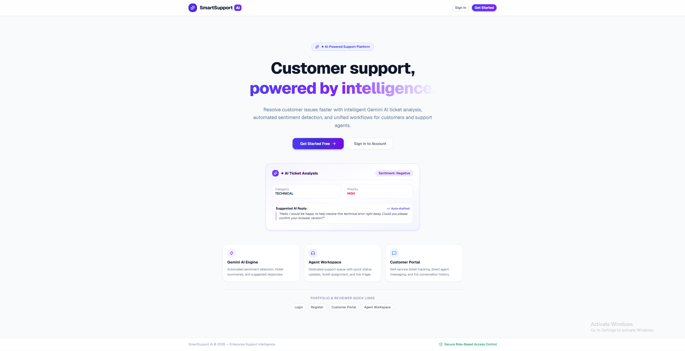
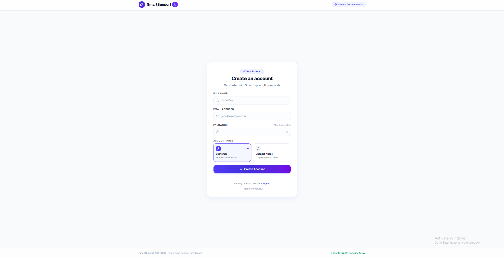
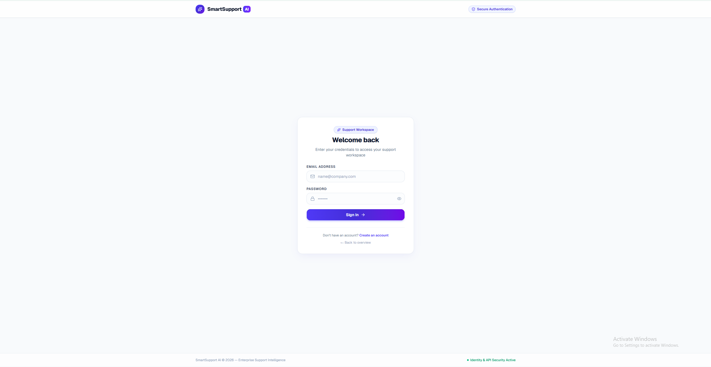
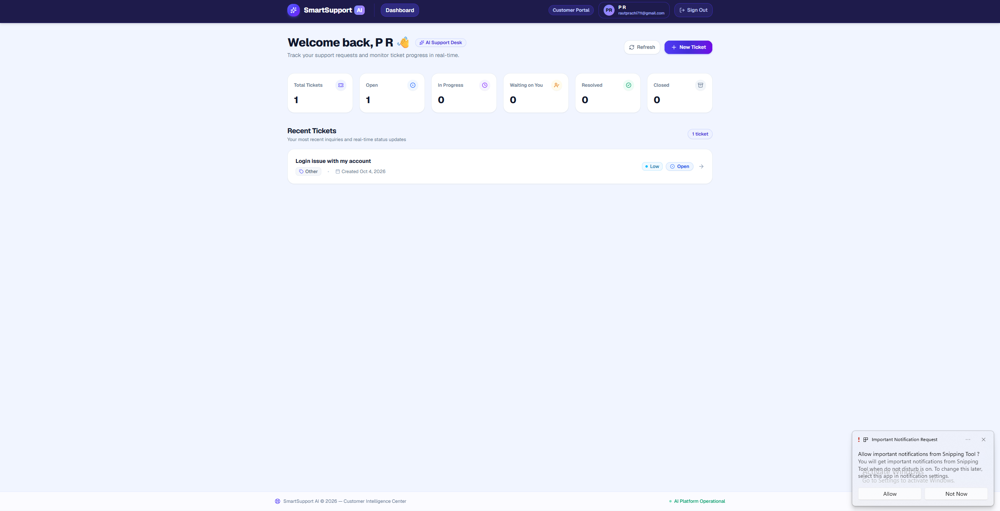
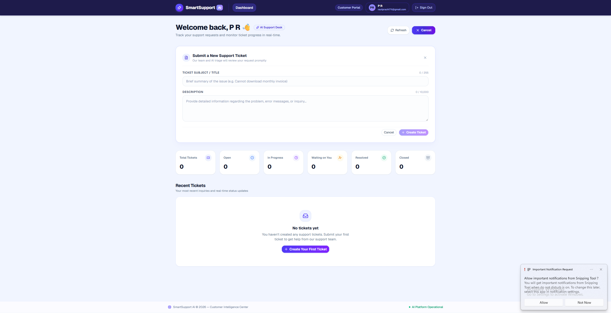
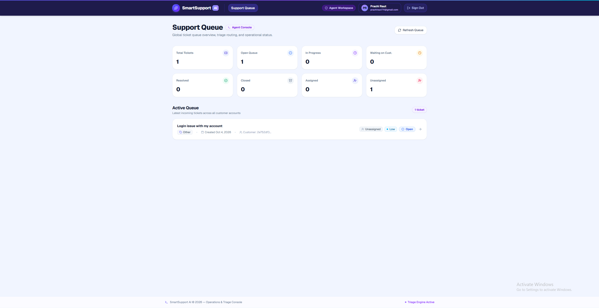
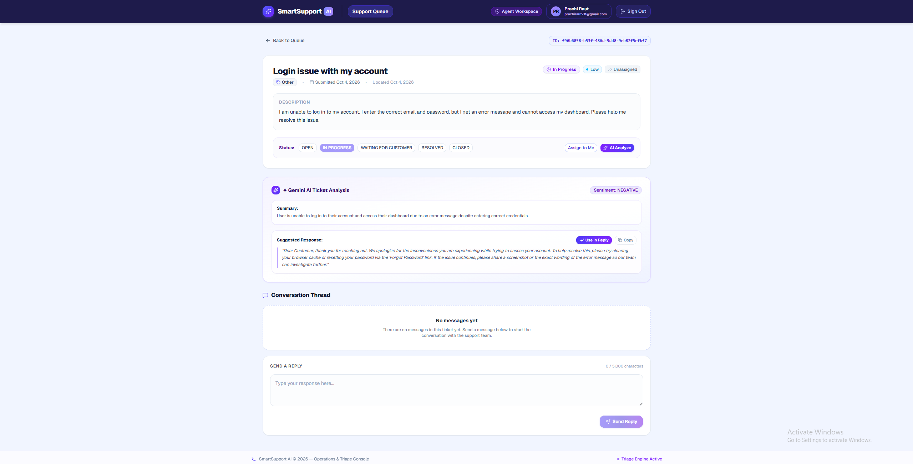

# SmartSupport AI

SmartSupport AI is an AI-assisted customer support and ticket management platform built with React, Node.js, PostgreSQL, and Google Gemini AI. It allows customers to submit and track support requests while providing agents with an intelligent workspace to triage, assign, and resolve tickets with automated AI insights.

**🌐 Live Demo:** https://smart-support-ai-two.vercel.app/

---

## ✨ Features

* **JWT authentication** with Customer and Agent roles
* **Customer ticket creation** and status tracking
* **Agent support queue** and ticket management
* **Ticket assignment**, status, priority, and category updates
* **Customer-Agent messaging** in unified conversation threads
* **Gemini AI ticket analysis** for triage and sentiment detection
* **Automated insights**: sentiment, category, priority, summary, and suggested replies
* **Responsive UI** built with Tailwind CSS and shadcn/ui

---

## 🛠️ Tech Stack

* **Frontend**: React, TypeScript, Vite, Tailwind CSS, shadcn/ui
* **Backend**: Node.js, Express.js, TypeScript, REST API, JWT
* **Database**: PostgreSQL, Prisma
* **AI**: Google Gemini API
* **DevOps**: Docker, Docker Compose, GitHub Actions
* **Deployment**: Vercel, Render, Neon PostgreSQL

---

## 📸 Screenshots

### Overview


### Authentication
| Create Account | Sign In |
| :---: | :---: |
|  |  |

### Customer Portal
| Customer Dashboard | Create Ticket |
| :---: | :---: |
|  |  |

### Agent Workspace & AI Analysis
| Agent Support Queue | Gemini AI Ticket Analysis |
| :---: | :---: |
|  |  |

---

## 🔄 How It Works

```text
Customer → React Frontend → Express API → PostgreSQL
                                 ↓
                             Gemini AI
```

Customers submit support tickets through the customer portal and exchange messages with support agents. Agents manage incoming requests from an active queue, update ticket properties, and reassign ownership. The backend leverages the Google Gemini API to analyze ticket content, classify sentiment, and generate drafted replies for agents.

---

## 🧪 Testing

* 234 backend tests passing
* Backend build passing
* Frontend lint passing
* Frontend production build passing
* GitHub Actions CI passing

---

## 🚀 Run Locally

### 1. Clone the repository
```bash
git clone https://github.com/prachiraut711/SmartSupport-AI.git
cd SmartSupport-AI
```

### 2. Configure environment variables
Copy the example environment files and add your configuration (including `GEMINI_API_KEY`):
```bash
cp .env.example .env
cp backend/.env.example backend/.env
cp frontend/.env.example frontend/.env
```

### 3. Start with Docker Compose
```bash
docker compose up --build
```

* **Frontend**: `http://localhost:3000`
* **Backend API**: `http://localhost:5000`
* **PostgreSQL**: `localhost:5432`

---

## 👩‍💻 Author

**Prachi Raut**

GitHub: https://github.com/prachiraut711/SmartSupport-AI
